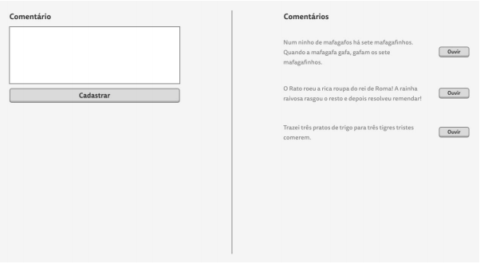

## Objetivo

Desenvolver uma aplicação web em Node.js com banco de dados MySQL. A aplicação consistirá somente de uma página com dois painéis: no painel posicionado a esquerda, o usuário poderá cadastrar novos comentários. No painel da direita todos os comentários cadastrados devem ser listados, com um botão ao lado de cada um que ao ser clicado executará um áudio de leitura do comentário.

Para realizar a conversão do comentário de texto para áudio, o candidato deverá utilizar a API Text to Speech do IBM Watson.

As operações de cadastro e atualização da lista de comentários devem ser realizadas via AJAX.

Abaixo disponibilizamos um mockup do que é esperado como interface:


## Observações
- O candidato poderá utilizar os frameworks que desejar, contanto que tenham como base Node.js e MySQL.
- O candidato deverá criar uma conta free na IBM para consumir a API Text to Speech.
- Organização do código e qualidade da interface desenvolvida serão avaliadas.


## Iniciando o projeto

### Subindo o banco de dados MySQL
Execute um dos comandos abaixo no terminal para executar o container do banco de dados.

Exibe os logs (O terminal fica travado na exibição dos logs, use CTRL+C para encerrar o container)
```
    docker-compose up
```
Oculta os logs (Para encerrar o container use o comando `docker-compose down`)
```
    docker-compose up -d
```

### Iniciando dependecias
```
    yarn install
```
ou
```
    npm install
```

Criando tabela
```
     npx sequelize db:migrate
```
